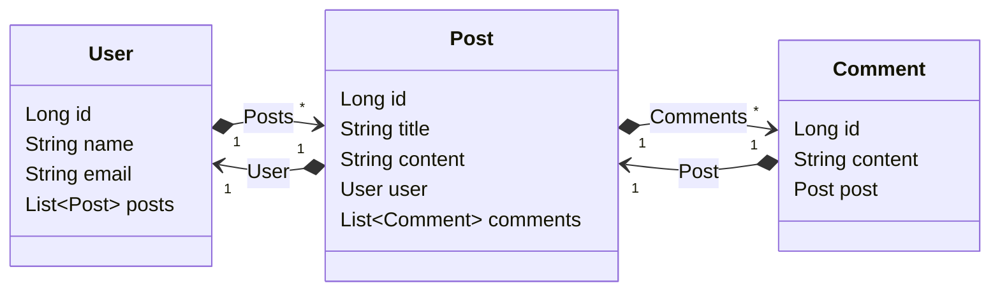

# Bootcamp Santander 2024 - Backend com Java.
Java RESTful API criada para o Bootcamp Santander 2024 - Backend com Java.

## Diagrama de Classes

## Link
[Acesse aqui](https://dio-challenge-java-production.up.railway.app/swagger-ui/index.html#/)
